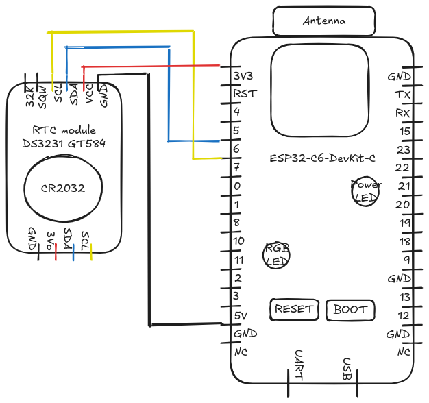

# DS3231_ESP32-C6

Basic functionnalities of DS3231 RTC module on a ESP32-C6 dev board.

## Components

- DS3231 GT584:
    - Give accurate date & time (secondes, minutes, hours) and date (day, month, year, day of the week)
    - Leap-Year Compensation Valid Up to 2100
    - Crystal oscillator is temperature compensated (TCXO) for more accurate measures
    - Battery is a common CR2032
    - [Link to the DS3231 Data Sheet](https://www.analog.com/media/en/technical-documentation/data-sheets/ds3231.pdf)
- ESP32-C6-DevKit C1
    - System on a Chip (SoC)
    - [Link to the manufacturer website](https://www.espressif.com/en/products/socs/esp32-c6)


## Electronic diagram

Interface used : I²C




## IDE & Librairies

Developed on Arduino IDE 2.3.6

Librairies required : 
 - for I2C interface : Wire.h
 - for DS3132 : RTClib.h


## Code example 01 : reading date & time

Display date & time

**Example of output**

```
18:29:22.310 -> Date & Time: 2025/4/30 (Wednesday) 18:29:00
18:29:22.310 -> Temperature: 25.00 C
18:29:23.308 -> Date & Time: 2025/4/30 (Wednesday) 18:29:01
18:29:24.306 -> Date & Time: 2025/4/30 (Wednesday) 18:29:02
```

## Code example 02 : setting date & time

Interactively setup Date & Time using serial monitor

**Example of output**

```
20:13:24.382 -> -------------------------------------------
20:13:24.382 -> COMMAND MENU:
20:13:24.382 -> -------------------------------------------
20:13:24.382 -> 1. Set time using format: set YYYY-MM-DD HH:MM:SS
20:13:24.414 ->    Example: set 2025-04-30 14:30:00
20:13:24.414 -> 2. Show these instructions: help
20:13:24.414 -> 3. Show current time: time
20:13:24.414 -> 4. Show temperature: temp
20:13:24.414 -> 
20:13:24.414 -> NOTE: Once time is set, it will be maintained by
20:13:24.414 -> the RTC module's battery even after power cycles.
20:13:24.414 -> -------------------------------------------
20:13:24.414 -> Current time: 2025-04-30 20:13:24 (Wednesday)
20:13:25.410 -> Current time: 2025-04-30 20:13:25 (Wednesday)
20:13:26.438 -> Current time: 2025-04-30 20:13:26 (Wednesday)
20:13:27.437 -> Current time: 2025-04-30 20:13:27 (Wednesday)
20:13:27.887 -> SUCCESS: Time has been set!
20:13:27.887 -> The RTC will maintain this time using its battery backup.
20:13:27.887 -> Current time: 2025-04-30 14:30:00 (Wednesday)
20:13:28.435 -> Current time: 2025-04-30 14:30:00 (Wednesday)
```